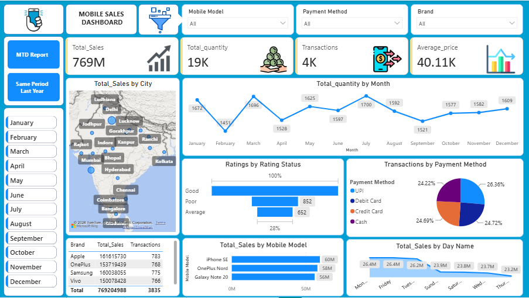
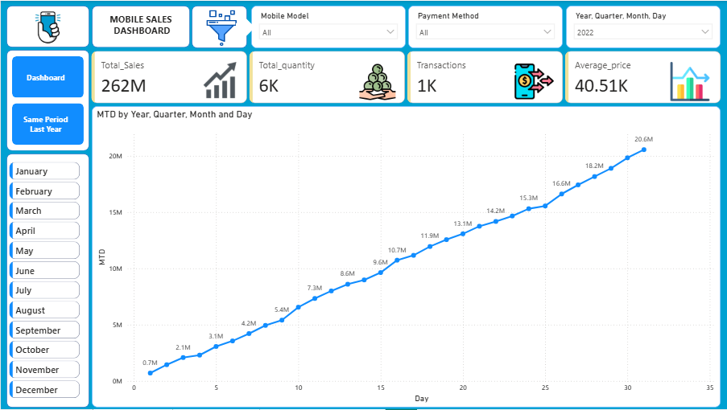

# 📱 Mobile Sales Analysis Dashboard | Power BI

## 📌 Project Overview

The **Mobile Sales Analysis Dashboard** is an interactive Business Intelligence dashboard developed using **Microsoft Power BI**.

The dashboard analyzes mobile sales performance across different dimensions such as **sales, quantity, transactions, average price, brands, mobile models, cities, payment methods, customer ratings, and time-based trends**.

The objective of this project is to transform raw sales data into meaningful business insights through data cleaning, analysis, visualization, and interactive dashboard development.

---

## 📊 Dashboard Preview



### Same Period Last Year Analysis


### MTD Sales Analysis



---

## 🎯 Business Objectives

* Monitor overall mobile sales performance
* Analyze monthly sales and quantity trends
* Identify top-performing mobile brands and models
* Analyze sales performance across different cities
* Understand customer payment preferences
* Analyze customer rating distribution
* Identify day-wise sales patterns
* Compare sales performance across different time periods
* Provide an interactive dashboard for business decision-making

---

## 📈 Key Performance Indicators

| KPI                   | Description                              |
| --------------------- | ---------------------------------------- |
| 💰 Total Sales        | Overall sales generated                  |
| 📦 Total Quantity     | Total number of mobile units sold        |
| 🧾 Total Transactions | Total number of sales transactions       |
| 💵 Average Price      | Average selling price of mobile products |

---

## 🔍 Dashboard Features

### 1. Sales Performance

* Total Sales analysis
* Monthly sales and quantity trends
* Sales by mobile model
* Sales by city
* Day-wise sales analysis

### 2. Product Analysis

* Brand-wise sales performance
* Mobile model-wise sales performance
* Quantity sold by month
* Transaction comparison across brands

### 3. Customer Analysis

* Customer rating distribution
* Payment method analysis
* Sales behavior across different locations

### 4. Interactive Filtering

The dashboard provides interactive slicers for:

* Mobile Model
* Payment Method
* Brand
* Month

Users can combine multiple filters to perform detailed analysis.

---

## 📊 Dashboard Visualizations

| Visualization | Analysis                                            |
| ------------- | --------------------------------------------------- |
| KPI Cards     | Total Sales, Quantity, Transactions & Average Price |
| Line Chart    | Monthly Quantity Trend                              |
| Map           | Total Sales by City                                 |
| Bar Chart     | Ratings by Rating Status                            |
| Donut Chart   | Transactions by Payment Method                      |
| Bar Chart     | Total Sales by Mobile Model                         |
| Line Chart    | Total Sales by Day Name                             |
| Matrix/Table  | Brand-wise Sales & Transactions                     |
| Slicers       | Brand, Model, Payment Method & Month                |

---

## 🛠️ Tools & Technologies

* **Microsoft Power BI**
* **DAX**
* **Power Query**
* Data Cleaning
* Data Transformation
* Data Analysis
* Data Visualization
* Interactive Dashboard Development
* Business Intelligence

---

## 💡 Key Insights

The dashboard enables analysis of:

* Overall sales and transaction performance
* Monthly sales and quantity trends
* Top-performing mobile brands
* Top-performing mobile models
* City-wise sales performance
* Customer payment preferences
* Customer rating distribution
* Day-wise sales patterns
* Brand-wise sales and transaction performance

---

## 📂 Project Structure

```text
Mobile-Sales-Analysis-PowerBI/
│
├── Dashboard/
│   └── Mobile_Sales_Dashboard.pbix
│
├── Screenshots/
├── 01_Main_Sales_Dashboard.png
├── 02_Same_Period_Last_Year_Analysis.png
└── 03_MTD_Sales_Analysis.png
│
└── README.md
```

---

## ▶️ How to Use

1. Download the `Mobile_Sales_Dashboard.pbix` file from the **Dashboard** folder.
2. Open the file using **Microsoft Power BI Desktop**.
3. Explore the dashboard pages and visualizations.
4. Use the slicers to filter the data.
5. Analyze the sales performance and business insights.


---

## 📁 Data Source

The dataset used for this project was obtained from an external publicly available source and used for **learning, analysis, and portfolio purposes**.

The dashboard development, data transformation, analysis, visualization, and reporting were performed in Microsoft Power BI.

---

## 👨‍💻 Author

### Gaurav Sahu

**Data Analyst | SQL | Python | Excel | Power BI**

Interested in **Data Analytics, Business Intelligence, Data Visualization, and Dashboard Development**.

---

⭐ If you find this project useful, feel free to explore the repository.
